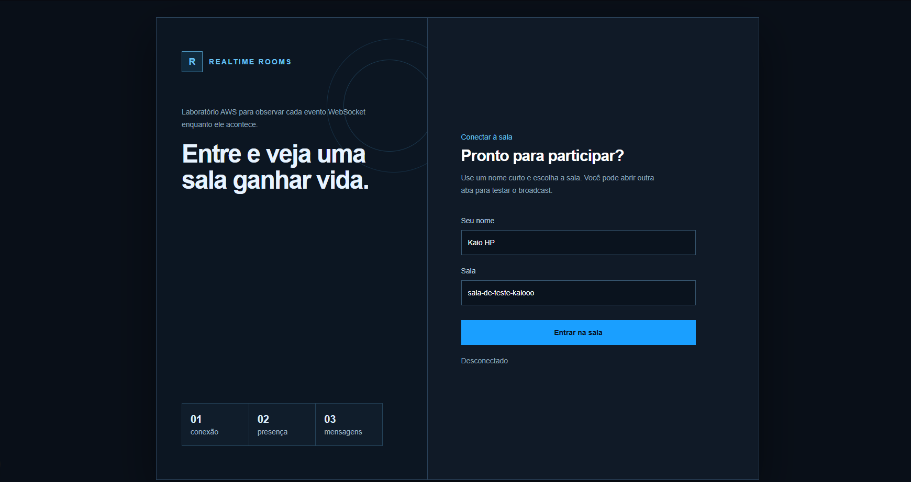
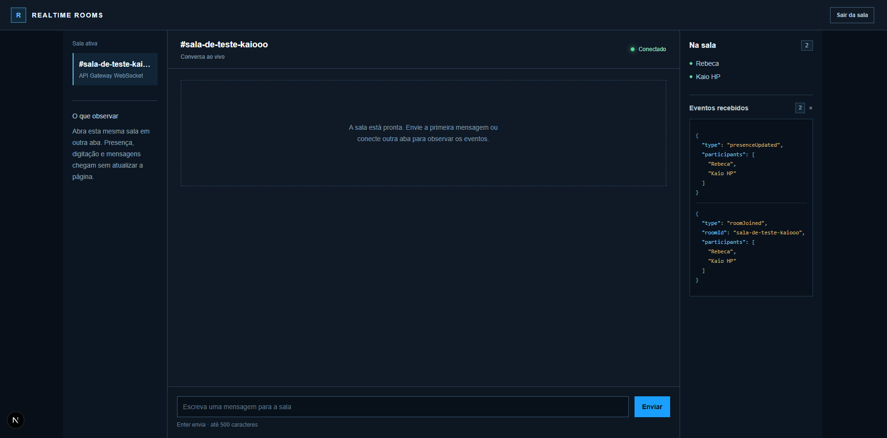
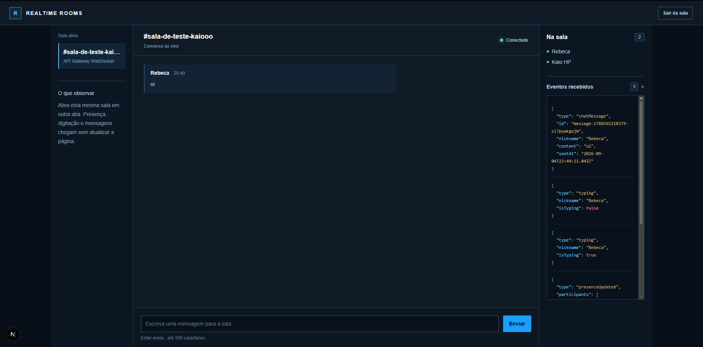
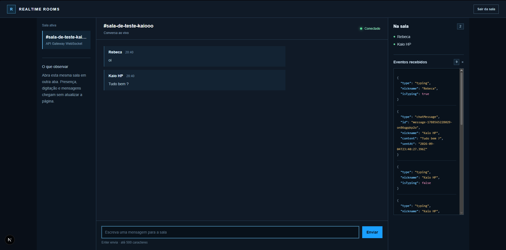
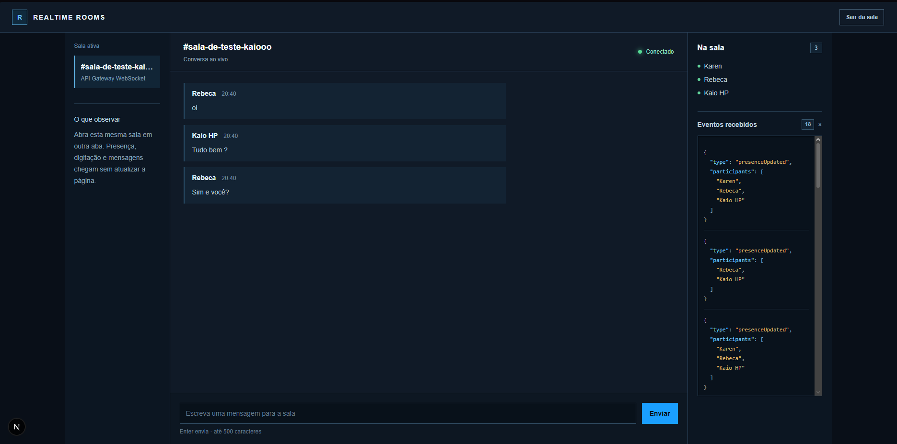
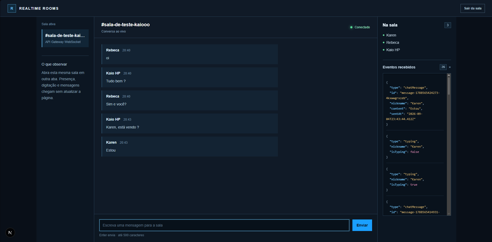

# Realtime Rooms — Ambiente de Testes WebSocket

Ambiente de testes para validar chat em tempo real com API Gateway WebSocket, Lambda, DynamoDB, Terraform e CI/CD com GitHub Actions usando OIDC.

O frontend permite que duas ou mais pessoas entrem na mesma sala, enviem mensagens, visualizem participantes e acompanhem eventos WebSocket em tempo real.

## Executar o frontend localmente

```powershell
npm install
Copy-Item .env.example .env.local
npm run dev
```

Defina `NEXT_PUBLIC_WS_URL` no `.env.local` com o output `websocket_url` do Terraform. Abra duas janelas do navegador, entre na mesma sala e envie mensagens entre elas.

## Como o chat funciona

Leia o guia [Como o chat WebSocket funciona](docs/README.md) para entender, sem pré-requisitos, o protocolo `wss://`, a conexão persistente e o caminho de presença, mensagens e indicador de digitação.

## Ambiente de Testes WebSocket

As capturas abaixo mostram o fluxo completo de validação local. Elas foram geradas pela própria aplicação.

### 1. Entrar na sala



Preencha nickname e sala. Ao clicar em **Entrar na sala**, o frontend abre o WebSocket em [Frontend — função `connect`](src/app/use-room-socket.ts#L75-L84).

### 2. Confirmar a conexão e a presença



Depois de `joinRoom`, a lista **Na sala** é atualizada pelo evento `presenceUpdated`. Veja [Backend — associação à sala e publicação da presença](src/lambdas/realtime.ts#L48-L57).

### 3. Enviar a primeira mensagem



O painel técnico permite comparar a mensagem visível com o JSON `chatMessage` recebido. A distribuição ocorre em [Backend — broadcast de `chatMessage`](src/lambdas/realtime.ts#L65-L69).

### 4. Adicionar outra pessoa à sala



Abra uma terceira aba com outro nickname. A nova conexão gera uma atualização de presença por meio de [Backend — consulta por sala e broadcast](src/lambdas/realtime.ts#L18-L25).

### 5. Observar a conversa crescer



Cada mensagem é independente: o DynamoDB mantém conexões, não histórico. O feed é atualizado em [Frontend — interpretação de eventos](src/app/use-room-socket.ts#L38-L73).

### 6. Inspecionar eventos de digitação e mensagens



O destaque de sintaxe ajuda a identificar chaves, strings, números e booleanos. A expiração de digitação está em [Frontend — debounce e evento de parada](src/app/use-room-socket.ts#L127-L141).

## Validar e gerar os pacotes

```powershell
npm run lint
npm test
npm run build:lambda
npm run build
terraform -chdir=infra init
terraform -chdir=infra validate
```

Após um apply, execute o smoke test para validar duas conexões entrando na mesma sala e recebendo um broadcast:

```powershell
npm run smoke:websocket -- "$(terraform -chdir=infra output -raw websocket_url)"
```

## Infraestrutura e state Terraform

O backend provisiona uma API WebSocket, duas Lambdas, uma tabela DynamoDB para conexões, IAM específico e logs do CloudWatch.

O bucket compartilhado `terraform-states-761018861028-us-east-1` é usado exclusivamente como backend remoto, com a chave `websocket-message/prod/terraform.tfstate`. Ele não é um recurso gerenciado por este repositório e nunca será removido pelo workflow de destroy.

## Pipeline GitHub Actions

O workflow **Infrastructure** lê dois booleanos versionados em `infra/locals.tf`:

- `provision_infrastructure=true`: cria ou atualiza a infraestrutura usando o plano salvo.
- `destroy_infrastructure=true`: remove somente os recursos desta aplicação usando um plano de destruição salvo.
- Ambos como `false`: valida e gera apenas o plano.
- Ambos como `true`: falha no preflight.

Esses gates controlam somente os workflows e nunca condicionam recursos Terraform. Isso evita que um push com ambos em `false` gere um plano de destruição acidental.

O workflow só pode executar a partir de `main`, `develop` ou `homolog`, que são as branches aceitas pela trust policy OIDC atual da role de deploy.

## Configuração necessária antes do primeiro deploy

1. Crie o repositório GitHub e envie o código para uma das branches autorizadas.
2. Confirme que a trust policy da role `arn:aws:iam::761018861028:role/github-actions-deploy-role` permite a branch usada. Leia o [guia de OIDC e trust policy](docs/oidc.md), que explica o template, o workflow e os pontos de configuração.
3. Confirme que a role possui acesso aos recursos de `infra/`, ao state `websocket-message/prod/terraform.tfstate` e ao arquivo de lock `.tflock` no bucket compartilhado.

O pipeline usa OIDC e credenciais temporárias; não use access keys da AWS como secrets no GitHub.
